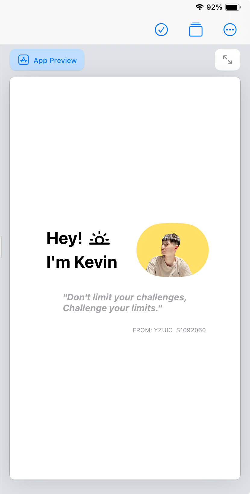

# HW1

[< Back to Index](./README.md)

```swift
import SwiftUI

struct ContentView: View {
    var body: some View {
        VStack {
            HStack{
                VStack{
                    Text("Hey! \(Image(systemName: "sun.horizon"))\nI'm Kevin")
                        .fontWeight(.bold)
                        .padding(8)
                        .lineSpacing(6.0)
                        .font(.title)
                    
                }.padding(.trailing, 15)
                Image("protrait")
                    .resizable()
                    .aspectRatio(contentMode: .fill)
                    .frame(width: 120, height: 90, alignment: .center)
                    .background(.yellow.opacity(0.6))
                    .cornerRadius(50.0, antialiased: true)
            }
            Text("\"Don't limit your challenges,\nChallenge your limits.\"")
            .italic(true)
            .fontWeight(.bold)
            .font(.system(size: 15))
            .foregroundColor(.gray.opacity(0.8))
            .padding()
            HStack{
                Text("FROM: YZUIC  S1092060")
                    .font(.system(size: 10, weight: .regular, design: .default))
                    .foregroundColor(Color.gray)
                    .frame(width: 270, alignment: .trailing)
            }
        }
    }
}
```

