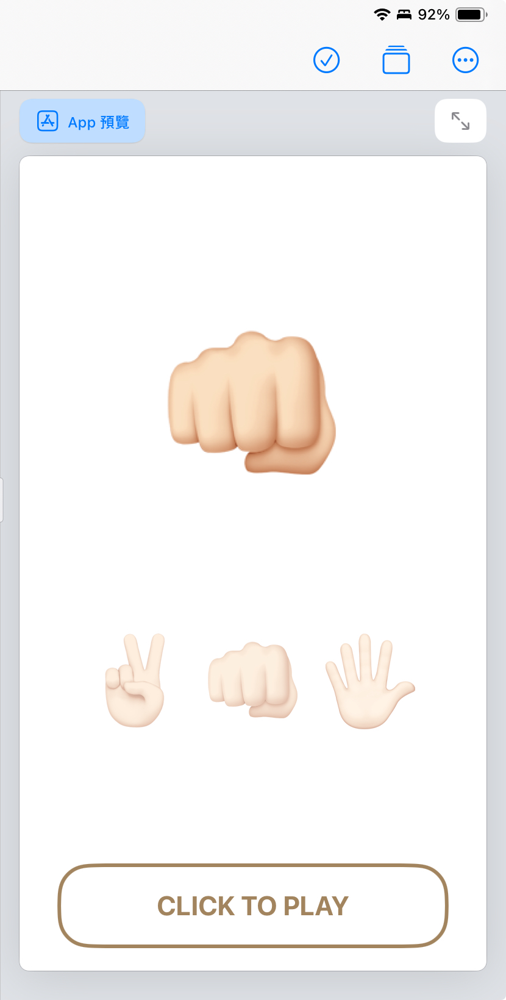
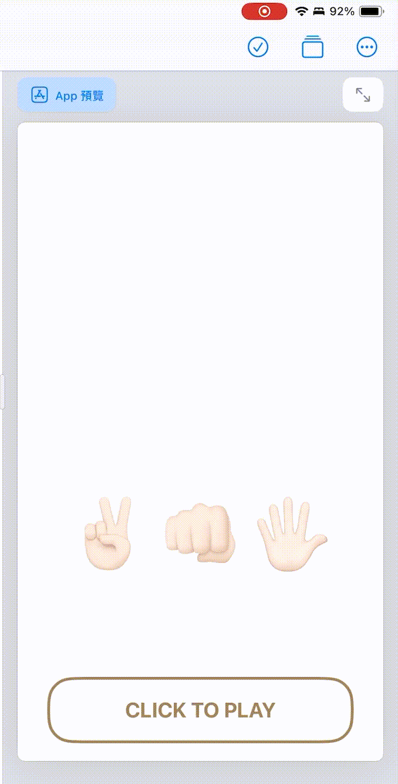

# HW2

[< Back to Index](./README.md)

```swift

import SwiftUI
import CoreMotion

let gestures = ["✌🏻", "👊🏻", "🖐🏻"]

let motionManager = CMMotionManager()

struct ContentView: View {
    @State var gesture: String = ""
    
    var body: some View {
        VStack {
            
            Spacer()
            
            Text(gesture)
                .font(.system(size: 150))
                .frame(width: 200, height: 200)
                .padding(.bottom, 50)
            
            HStack{
                ForEach(gestures, id: \.self){ gesture in
                    Text(gesture)
                            .font(.system(size: 80))
                            .opacity(0.5)
                }
            }
            
            Spacer()
            
            Button(action: {
                gesture = gestures[Int.random(in: 0 ..< gestures.count)]
            }, label: {
                Text("CLICK TO PLAY")
                    .font(.title2)
                    .fontWeight(.bold)
                    .padding(.vertical, 20)
                    .padding(.horizontal, 80)
                    .background(
                        RoundedRectangle(cornerRadius: 25.0)
                            .stroke(lineWidth: 3)
                    )
            }).padding(.bottom, 20)
            
        }
    }
}


```



