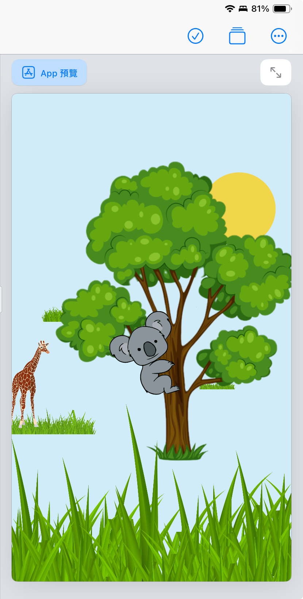

# HW3-1

[< Back to Index](./README.md)

```swift

import SwiftUI

struct ContentView: View {
    var body: some View {
        ZStack{
            Rectangle()
                .fill(.cyan)
                .opacity(0.23)
                .frame(height: UIScreen.screenHeight)
            Circle()
                .fill(.yellow)
                .opacity(0.7)
                .frame(width: 100)
                .offset(x: 120, y:-140)
            grassView()
                .frame(width: 100)
                .offset(x: -100)
            grassView()
                .frame(width: 50)
                .offset(x: 90, y: 100)
                .opacity(0.9)
            grassView()
                .frame(width: 130)
                .offset(x: -140, y: 150)
                .opacity(0.9)
            HStack {
                giraffeView()
                ZStack{
                    treeView()
                    kawalaView()
                        .offset(x: -30, y: 55)
                }
            }.frame(width: 300)
            grassView()
                .frame(width: 1000)
                .offset(y: 270)
        }
        
    }
}

struct giraffeView: View{
    var body: some View{
        Image("giraffe")
            .resizable()
            .aspectRatio(contentMode: .fit)
            .frame(height: 120)
            .padding(.top, 200)
    }
}

struct treeView: View{
    var body: some View{
        Image("tree")
            .resizable()
            .aspectRatio(contentMode: .fill)
            .frame(height: UIScreen.screenHeight/2)
    }
}

struct kawalaView: View{
    var body: some View{
        Image("kawala")
            .resizable()
            .aspectRatio(contentMode: .fit)
            .frame(width: 120)
    }
}

struct grassView:View{
    var body: some View{
        Image("grass")
            .resizable()
            .aspectRatio(contentMode: .fit)
    }
}

extension UIScreen{
static let screenHeight = UIScreen.main.bounds.height
}


```


