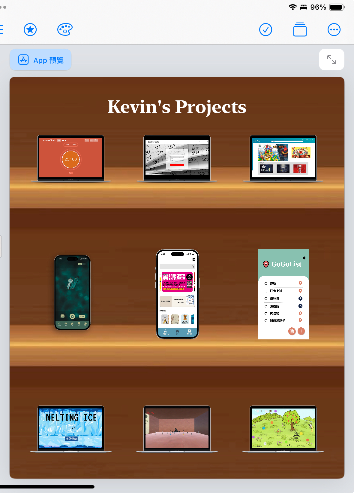

# HW3

[< Back to Index](./README.md)

```swift

import SwiftUI

struct ContentView: View {
    var body: some View {
        ZStack {
            backgroundView()
            VStack{
                titleView(title: "Kevin's Projects")
                
                HStack{
                    macbookView(imageName: "pomoclock")
                    macbookView(imageName: "dddate")
                    macbookView(imageName: "justplay")
                }
                
                Spacer(minLength: 100)
                
                HStack{
                    phoneView(imageName: "gosearch")
                    phoneView(imageName: "library")
                    phoneView(imageName: "gogolist")
                    
                }
                
                Spacer(minLength: 100)
                
                HStack{
                    macbookView(imageName: "melting-ice")
                    macbookView(imageName: "rebirth")
                    macbookView(imageName: "dotdotdot")
                }
            }
            .frame(height: UIScreen.screenHeight-250)
        }
    }
}

struct titleView: View {
    var title:String
    var body: some View {
        Text(title)
            .font(.system(size: 30))
            .fontWeight(.bold)
            .foregroundColor(.white)
            .fontDesign(.serif)
    }
}

struct backgroundView: View{
    var body: some View{
        Image("cabinet")
            .resizable()
            .aspectRatio(contentMode: .fill)
            .frame(height: UIScreen.screenHeight)
    }
}

struct macbookView: View {
    var imageName:String
    var body: some View {
        Image(imageName)
            .resizable()
            .aspectRatio(contentMode: .fit)
            .frame(height: 80)
            .padding(10)
    }
}

struct phoneView: View {
    var imageName: String
    var body: some View {
        Image(imageName)
            .resizable()
            .aspectRatio(contentMode: .fit)
            .frame(height: 150)
            .padding(.horizontal, 45)
    }
}

extension UIScreen{
    static let screenWidth = UIScreen.main.bounds.width
    static let screenHeight = UIScreen.main.bounds.height
    static let screenSize = UIScreen.main.bounds.size
}

```


