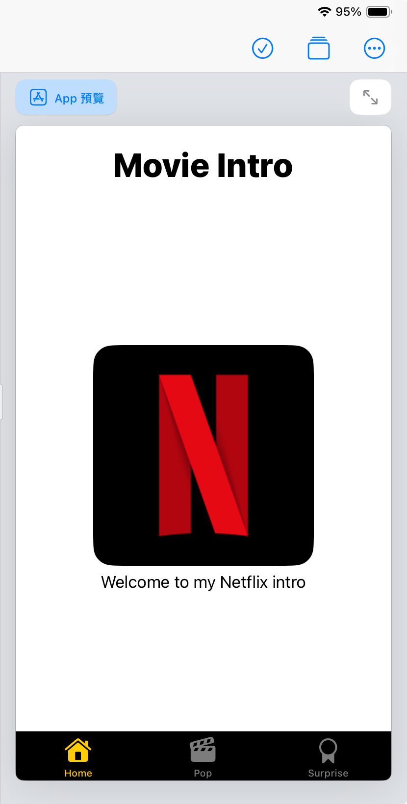

# HW4

[< Back to Index](./README.md)

ContentView

```swift
import SwiftUI

struct ContentView: View {
    var body: some View {
        VStack {
            Text("Movie Intro")
                .font(.largeTitle)
                .fontWeight(.heavy)
                .foregroundStyle(.primary)
            TabView{
                Group{
                    WelcomeView()
                        .tabItem { 
                            Image(systemName: "house")
                            Text("Home")
                        }
                    MovieListView()
                        .tabItem { 
                            Image(systemName: "movieclapper")
                            Text("Pop")
                        }
                    SurpriseView()
                        .tabItem { 
                            Image(systemName: "rosette")
                            Text("Surprise")
                        }
                }
                // tool bar background color
                .toolbarBackground(Color.black, for: .tabBar)
                .toolbarBackground(.visible, for: .tabBar)
            }
            .tint(.yellow) // icon color
        }.padding(.top, 20)
    }
}

```

---
WelcomeView

```swift
import SwiftUI

struct WelcomeView: View {
    var body: some View {
        VStack {
            Image("netflix")
                .cornerRadius(20.0)
            Text("Welcome to my Netflix intro")
        }
    }
}

```



---

MovieListView

```swift
import SwiftUI

struct Movie: Identifiable {
    var id = UUID()
    var name: String
    var image: String
    var description: String
}

var movies = [
    Movie(name: "Stranger Things", image: "strangerThings", description: "鎮上一名小男孩不知去向後，謎樣的秘密實驗、恐怖的超自然力量，以及一位詭異的小女孩，也跟著浮出檯面。"),
    Movie(name: "Wednesday", image: "wednesday", description: "星期三·阿達聰明伶俐，最會冷嘲熱諷，老愛說自己「心已死」。且看她在奈落學院調查連環謀殺案，結交新朋友，同時也樹立新敵人。"),
    Movie(name: "CopyCat Killer", image: "killer", description: "翻拍自日本推理女王宮部美幸同名暢銷小說，故事描述台灣 90 年代，一名擅長偵辦兇殺刑案的檢察官郭曉其（吳慷仁 飾）面對當時第一起的連續殺人命案，兇手獨特的犯案手法與瘋狂行徑讓剛興起的各大電視媒體爭相報導，隨著偷拍、炒話題、搶收視率越演越烈，兇手也跟著媒體亂象開始操弄人心、挑釁司法，讓曉其決心不惜染髒自己的手，賭上人生也要拖出兇手的犯案證據。"),
    Movie(name: "SpiderMan: No Way Home", image: "spiderman", description: "故事接續《蜘蛛人：離家日》片尾，描述號角日報對外公佈了蜘蛛人真實身份是彼得帕克後，警察指控他利用無人機殺害神秘法師，讓彼得帕克遭到輿論攻擊、而他與親友的生活也大受影響。為了改變現況，絕望的彼得帕克找上了「奇異博士」，希望他施展法術讓大家忘記他是蜘蛛人的事實。"),
    Movie(name: "The Good Place", image: "theGoodPlace", description: "自私的艾莉諾·薛爾史托普過世後，卻在陰錯陽差之下來到良善之地。她一心想待在這裡，因此努力變成更好的人。")
]

struct BasicImageRow: View {
    var thisMovie: Movie
    var body: some View{
        HStack{
            Image(thisMovie.image)
                .resizable()
                .aspectRatio(contentMode: .fill)
                .frame(width: 50, height: 80)
                .cornerRadius(5)
            Text(thisMovie.name)    
        }  
    } 
}

struct MovieDetailView: View {
    @Environment(\.presentationMode) var presentationMode
    var thisMovie: Movie
    var body: some View{
        ScrollView{
            VStack { 
                Image(thisMovie.image)
                    .resizable()
                    .aspectRatio(contentMode: .fill)
                    .clipped()
                Text(thisMovie.name)
                    .font(.system(.title))
                    .padding(.top)
                Spacer()
                Text(thisMovie.description)
                    .font(.system(.subheadline, design: .rounded))
                    .fontWeight(.light)
                    .padding()
                Spacer()
            }
        }
        .overlay(
            HStack {
                Spacer()
                VStack {
                    Button(action: {
                        self.presentationMode.wrappedValue.dismiss()
                    }, label: {
                        Image(systemName: "chevron.down.circle.fill")
                            .font(.title)
                            .foregroundColor(.white.opacity(0.55))
                    })
                    .padding(.trailing, 20)
                    .padding(.top, 20)
                    Spacer()
                }
            })
    }
}

struct MovieListView: View {
    @State var showDetailView = false
    @State var selsectedMovie: Movie?
    var body: some View{
        NavigationView {
            List(movies) { movieItem in
                BasicImageRow(thisMovie: movieItem)
                    .onTapGesture {
                        self.showDetailView = true
                        self.selsectedMovie = movieItem
                    }
                    .sheet(item: self.$selsectedMovie) { thisMovie in
                        MovieDetailView(thisMovie: thisMovie)
                    }
            }
        }    
    }
}
```


---

SurpriseView

```swift
import SwiftUI
struct  MovieInfo: Identifiable {
    var id = UUID()
    var chName: String
    var enName: String
    var imgName: String
}
var mySprs = [
    MovieInfo(chName: "怪奇物語", enName: "Stranger Things", imgName: "strangerThings"),
    MovieInfo(chName: "星期三", enName: "Wednesday", imgName: "wednesday"),
    MovieInfo(chName: "模仿犯", enName: "CopyCat Killer", imgName: "killer"),
    MovieInfo(chName: "蜘蛛人：無家日", enName: "SpiderMan: No Way Home", imgName: "spiderman"),
    MovieInfo(chName: "良善之地", enName: "The Good Place", imgName: "theGoodPlace")
]

struct SurpriseView: View{
    @State var sprList: [MovieInfo] = mySprs
    var body: some View {
        VStack {
            ZStack {
                ForEach(sprList){ sprItem in
                    VStack {
                        Image(sprItem.imgName)
                            .resizable()
                            .aspectRatio(contentMode: .fit)
                            .cornerRadius(10.0)
                            .frame(width: 240)
                            .padding()
                        Text(sprItem.enName)
                            .font(.title)
                            .foregroundStyle(.white)
                        Text(sprItem.chName)
                            .font(.title2)
                        .foregroundStyle(.white)
                        Spacer()
                    }
                    .frame(minWidth: 0, idealWidth: 100, maxWidth: 290,
                           minHeight: 0, idealHeight: 100, maxHeight: 470, alignment: .center)
                    .background(Color.black)
                    .cornerRadius(15.0)   
                    .gesture(DragGesture()
                        .onChanged({ value in
                            sprList.append(mySprs[Int.random(in: 0 ..< mySprs.count)])
                        })
                            .onEnded({ value in
                                sprList.removeFirst()
                            })
                    )
                }
            }
            Text("Drag to get a special movie.")
        }
    }
}

```

滑動卡片可以隨機出現電影

